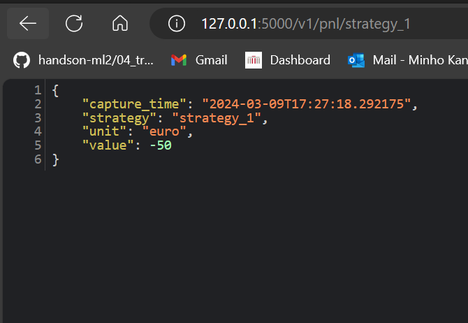
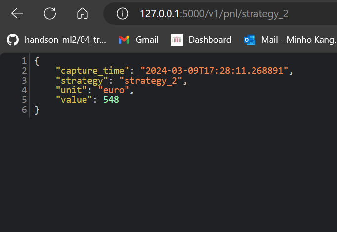

# FlexPwr_Minho

* [Background](#Background)
* [Solution](#Solution)
  * [Task1](#Task1)
  * [Task2](#Task2)
  * [Task3](#Task3)
* [Setup](#Setup)

## Background
This repo consists of three solutions for three tasks in [**FlexPower QuantChallenge**](https://github.com/FlexPwr/QuantChallenge). I used Python packages [`sqlite3`](https://docs.python.org/3/library/sqlite3.html) (task 1 & 2), [`flask`](https://flask.palletsprojects.com/en/3.0.x/) (task 3). 

## Solution

### Task1 
[task1_volcalculator.py](task1_volcalculator.py)
* Both functions (compute_total_buy_volume, compute_total_sell_volume) have the same arguments: `database_path(str)` and `table_path(str)`. In this task, the database_path is `trades.sqlite` and the table_name is `epex_12_20_12_13`.   
* I combined those two functions as a `class`. Even though it is now overused for only two functions, there is a possibility for adding more functions that require the same arguments later. 
* I calculated the volume in the two functions by using SQL query. For example, in the function `compute_total_buy_function`, the query is like the below
```python
cursor.execute(f"SELECT SUM(QUANTITY) FROM {self.table_name} WHERE SIDE ='buy' ")
```

### Task2 
[task2_computepnl.py](task2_computepnl.py)
* Compared to the task 1, one argument is added: `strategy_id(str)` 
* But same as task 1, here I also used SQL Query for computing the PnL like below 
```python
cursor.execute(f"SELECT SUM(CASE WHEN SIDE='sell' THEN QUANTITY * PRICE ELSE -QUANTITY * PRICE END)"
               f"FROM {table_name} WHERE strategy = ?", (strategy_id,))
```

### Task3 
[task3_pnlapp.py](task3_pnlapp.py)

* If you already set up your virtual environment, you can run the file by `flask --app task3_pnlapp.py run --debug`. 
* I imported the task 2 function (`compute_pnl`)
```python
from task2_computepnl import compute_pnl
```
* The function `main()` defines the initial pages. The page shows JSON file of `strategy_1`, which is result of the function `get_pnl`
* The function `get_pnl` gets `strategy_id` as an argument and returns a JSON file.
* The JSON file contains the `strategy_id`, `pnl_value`, `unit(euro)`, and the `capture_time`

```python
    response_data = {
        'strategy': strategy_id,
        'value': pnl_value,
        'unit': 'euro',
        'capture_time': datetime.utcnow().isoformat()  # Use the current time
    }
```
*  And the JSON files are below (strategy 1 & 2). By changing the `strategy_id` in URL, the different value comes out

<div style="display: flex; justify-content: space-between;">
    
    
</div>


